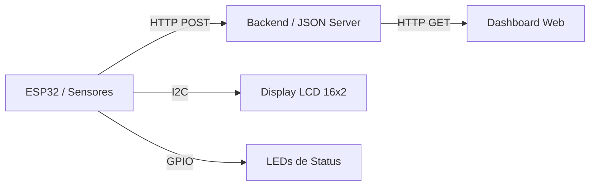

# AstroTrack - Logística Inteligente & Telemetria Satelital

<p align="center">
  
  
  
</p>

## Visão Geral
O **AstroTrack** é um protótipo de monitoramento logístico de alto desempenho projetado para a **Global Solution**. O sistema integra sensores de borda (Edge Computing) com uma interface de monitoramento em tempo real, permitindo o rastreamento preciso de ativos, detecção de violação de carga e disparos de pânico para segurança operacional em rotas críticas.


## Arquitetura da Solução
A solução é composta por três camadas integradas:

1.  **Edge (ESP32):** Coleta telemetria (GPS simulado), monitora o sensor de porta e o botão de pânico. Envia os dados via HTTP POST para o gateway.
2.  **Gateway/Backend (JSON Server):** Atua como o barramento de dados, recebendo os estados do dispositivo e persistindo para consulta.
3.  **Frontend (Dashboard):** Interface web responsiva que consome os dados do backend e apresenta alertas visuais dinâmicos.



## Hardware e Pinagem

| Componente | Pino (GPIO) | Descrição |
| :--- | :--- | :--- |
| **ESP32 DevKit V4** | - | Microcontrolador com WiFi integrado |
| **LCD 16x2 I2C** | 21 (SDA), 22 (SCL) | Feedback visual em tempo real para o motorista |
| **Botão de Pânico** | 12 | Input para emergências (Pull-up interno) |
| **Sensor de Porta** | 13 | Simulação de Reed Switch para abertura de baú |
| **LED Alerta (Red)** | 2 | Sinalização visual de pânico ativo |
| **LED Sistema (Green)** | 4 | Indicador de conexão WiFi e pulso do sistema |


## Configuração do Ambiente

### 1. Simulação (Wokwi)
O projeto está pronto para rodar no **Wokwi**. As dependências de bibliotecas são:
- `LiquidCrystal I2C`
- `ArduinoJson`

### 2. Backend (Local)
O sistema espera um endpoint REST para receber os dados. Você pode subir um servidor de testes rapidamente usando `json-server`:
```bash
# Instalação
npm install -g json-server

# Execução (dentro da pasta dashboard)
json-server --watch db.json --host 0.0.0.0
```
> *Nota: No código do ESP32 (`astrotrack_esp32.ino`), certifique-se de ajustar a variável `serverUrl` com o IP da sua máquina.*


##  Como Operar

1.  **Inicie o Backend:** Suba o `json-server` conforme as instruções acima.
2.  **Inicie o Firmware:** No Wokwi, clique no Play.
3.  **Interação Local:**
    - Pressione o botão **Vermelho (GPIO 12)** para ativar o pânico.
    - Pressione o botão **Verde (GPIO 13)** para simular a abertura da porta.
    - O LCD mostrará os estados instantaneamente.
4.  **Monitoramento Remoto:** Abra o arquivo `dashboard/index.html` em seu navegador para visualizar o painel de controle atualizando em tempo real.

---

## Demonstração
Acompanhe o funcionamento detalhado do sistema no vídeo: [Link do Vídeo no YouTube](https://youtu.be/ZLHSfjux70o)


## Autores
- **Artur Correia** - [GitHub](https://github.com/artcorreia)
- **Gabriel H** - [GitHub](https://github.com/gabrielhensg)
- **José Ricardo** - [GitHub](https://github.com/jr-iannuzzi)
- **Rafael de Freitas** - [GitHub](https://github.com/devfreitas)
- **Rafael Pascotte** - [GitHub](https://github.com/pascotterafaaa)

---
<p align="center">
  <b>FIAP - Disruptive Architectures (IoT) - Global Solution 2026</b>
</p>
