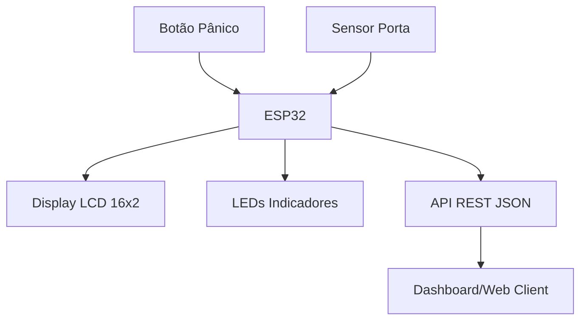

# AstroTrack - Logística Satelital

<p align="center">
  
  
  
  
</p>

## 1. Introdução e Contexto
O **AstroTrack** é uma solução avançada de monitoramento logístico desenvolvida para a **Global Solution**, focada na integração entre hardware inteligente e conectividade satelital. Este módulo de IoT atua como a inteligência de borda (Edge Intelligence) do ecossistema, permitindo a coleta de telemetria em tempo real, gestão de segurança da carga e check-ins automáticos de posição, mesmo em áreas remotas.

---

## 2. Arquitetura do Sistema
O sistema é estruturado em três camadas principais:
1.  **Camada de Percepção (Sensores):** Coleta de dados de pânico e integridade da carga (sensor de porta).
2.  **Camada de Processamento (ESP32):** Lógica de controle, gerenciamento de estado e interface local.
3.  **Camada de Comunicação (Networking):** Gateway WiFi que expõe os dados via servidor HTTP embarcado.



---

## 3. Hardware e Pinagem (Datasheet Simplificado)

| Componente | Pino ESP32 (GPIO) | Função Técnica |
| :--- | :--- | :--- |
| **ESP32 Dev Module** | - | Unidade de Processamento Central |
| **LCD 16x2 I2C** | 21 (SDA), 22 (SCL) | Interface I2C de baixa ocupação de pinos |
| **Botão Pânico** | 12 | Entrada Digital com Pull-up Interno |
| **Sensor Porta** | 13 | Entrada Digital (Simulação de Reed Switch) |
| **LED Vermelho** | 2 | Saída PWM/Digital para Alerta Visual |
| **LED Verde** | 4 | Indicador de Heartbeat e Conexão |
| **Resistores** | - | 220Ω para limitação de corrente dos LEDs |

---

## 4. Documentação da API REST

O ESP32 hospeda um servidor HTTP na porta **80**. Abaixo, os detalhes para integração:

### GET `/status`
Retorna o "Health Check" e o estado atual de todos os periféricos.
*   **Exemplo de Resposta:**
    ```json
    {
      "panic": false,
      "door_open": false,
      "system_led": true,
      "last_sync": "Never"
    }
    ```

### GET `/gps`
Retorna coordenadas geográficas simuladas que sofrem variações aleatórias para simular o movimento real do veículo.
*   **Exemplo de Resposta:**
    ```json
    {
      "lat": -23.55052,
      "lng": -46.63331,
      "satellites": 8
    }
    ```

### POST `/panic/toggle`
Endpoint de controle que permite disparar o alerta de pânico remotamente via software (útil para testes de integração e comando central).
*   **Exemplo de chamada via `curl`:**
    ```bash
    curl -X POST http://<IP_DO_ESP>/panic/toggle
    ```

---

## 5. Manual de Operação e Instalação

### Pré-requisitos Técnicos
- **VS Code** + Extensão **Wokwi Simulator**.
- Bibliotecas (instaladas automaticamente via `libraries.txt`):
  - `ArduinoJson` (Manipulação de payloads JSON)
  - `LiquidCrystal I2C` (Controle do display via barramento serial)

### Como executar
1. Abra o arquivo `iot/astrotrack_esp32/astrotrack_esp32.ino`.
2. O simulador Wokwi abrirá o painel lateral. Se estiver usando VS Code, use o comando `Wokwi: Start Simulator`.
3. **Interação:**
   - Clique no botão **PANIC** (Vermelho) para alternar o estado de alerta.
   - Clique no botão **DOOR** (Azul) para simular a abertura/fechamento do baú do caminhão.
   - Observe as atualizações instantâneas no **LCD**.

## Link Demonstração
Link da demonstração no Youtube
> Adicionar o video

## Autores
Artur Correia - [GitHub](https://github.com/artcorreia)<br>
Gabriel H - [GitHub](https://github.com/gabrielhensg)<br>
José Ricardo - [GitHub](https://github.com/jr-iannuzzi)<br> 
Rafael de Freitas - [GitHub](https://github.com/devfreitas)<br> 
Rafael Pascotte - [GitHub](https://github.com/pascotterafaaa)

---
<p align="center">
  <b>FIAP - Disruptive Architectures (IoT)</b><br>
</p>
